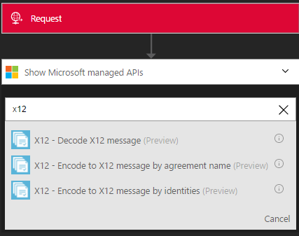

<properties 
	pageTitle="Learn about Enterprise Integration Pack Decode X12 Message Connctor | Microsoft Azure App Service | Microsoft Azure" 
	description="Learn how to use partners with the Enterprise Integration Pack and Logic apps" 
	services="logic-apps" 
	documentationCenter=".net,nodejs,java"
	authors="padmavc" 
	manager="erikre" 
	editor=""/>

<tags 
	ms.service="logic-apps" 
	ms.workload="integration" 
	ms.tgt_pltfrm="na" 
	ms.devlang="na" 
	ms.topic="article" 
	ms.date="08/15/2016" 
	ms.author="padmavc"/>

# Get started with Decode X12 Message

Validates EDI and partner specific properties, generates XML document for each transaction set and generates acknowledgment for processed transaction.

## Create the connection

### Prerequisites

* An Azure account; you can create a [free account](https://azure.microsoft.com/free)

* An Integration Account is required to use Encode AS2 message connector. See details on how to create an [Integration Account](https://azure.microsoft.com/en-us/documentation/articles/app-service-logic-enterprise-integration-accounts/), add [partners](https://azure.microsoft.com/en-us/documentation/articles/app-service-logic-enterprise-integration-partners/) and [AS2 agreement](https://azure.microsoft.com/en-us/documentation/articles/app-service-logic-enterprise-integration-x12/) to it

### Connect to Decode X12 Message using the following steps:

1. Create a Logic App.  [Create a Logic App](https://azure.microsoft.com/en-us/documentation/articles/app-service-logic-create-a-logic-app/) provides an example

2. This connector does not have any triggers. Use other triggers to start the Logic App, such as a Request trigger.  In the Logic App designer, add a trigger and add an action.  Select Show Microsoft managed APIs in the drop down list and then enter “x12” in the search box.  Select X12 – Decode X12 Message

	  

3. If you haven’t previously created any connections to Integration Account, you are prompted for the connection details

	 	

4. Enter the Integration Account details.  Properties with an asterisk are required

	| Property | Details |
	| -------- | ------- |
	| Connection Name * | Enter any name for your connection |
	| Integration Account * | Enter the Integration Account name; Be sure your Integration Account and Logic app are in the same Azure location |

	Once complete, your connection details look similar to the following
	
	 

5. Select **Create**
	
6. Notice the connection has been created.

	 

7. Select X12 flat file message to decode

	 

## X12 Decode does following

* Validates the envelope against trading partner agreement
* Generates an XML document for each transaction set.
* Validates EDI and partner-specific properties. This includes
	* EDI structural validation, and extended schema validation
	* Validation of the structure of the interchange envelope.
	* Schema validation of the envelope against the control schema.
	* Schema validation of the transaction-set data elements against the message schema.
	* Validation of the types of transaction sets within a single group based on the transaction set -group mapping provided by X12 standards.
	* EDI validation performed on transaction-set data elements. This is performed if enabled in the agreement properties.
* Verifies that the interchange, group, and transaction set control numbers are not duplicates, if the checks are enabled in the X12 agreement send settings.
	* Checks the interchange control number against previously received interchanges.
	* Checks the group control number against other group control numbers in the interchange.
	* Checks the transaction set control number against other transaction set control numbers in that group.
* Converts the entire interchange to XML if the X12 agreement receive settings configured to one of the Preserve Interchange.
	* Split Interchange as transaction sets - suspend transaction sets on error: Parses each transaction set in an interchange into a separate XML document. If one or more transaction sets in the interchange fail validation, then X12 Decode suspends only those transaction sets.
	* Split Interchange as transaction sets - suspend interchange on error: Parses each transaction set in an interchange into a separate XML document.  If one or more transaction sets in the interchange fail validation, then X12 Decode suspends the entire interchange.
	* Preserve Interchange - suspend transaction sets on error: Creates an XML document for the entire batched interchange. X12 Decode suspends only those transaction sets that fail validation, while continuing to process all other transaction sets
	* Preserve Interchange - suspend interchange on error: Creates an XML document for the entire batched interchange. X12 Decode suspends the entire interchange, if one or more transaction sets in the interchange fail validation
* Generates a Technical and/or Functional acknowledgment (if configured).
	* A Technical Acknowledgment generates as a result of header validation. The technical acknowledgment reports the status of the processing of an interchange header and trailer by the address receiver.
	* A Functional Acknowledgment generates as a result of body validation. The functional acknowledgment reports each error encountered while processing the received document

